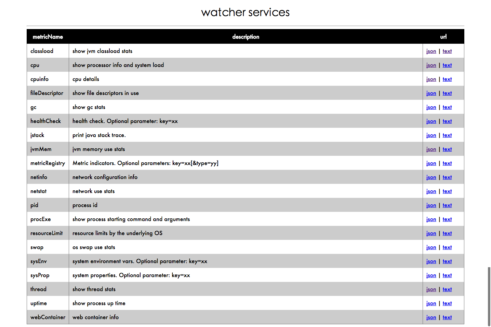
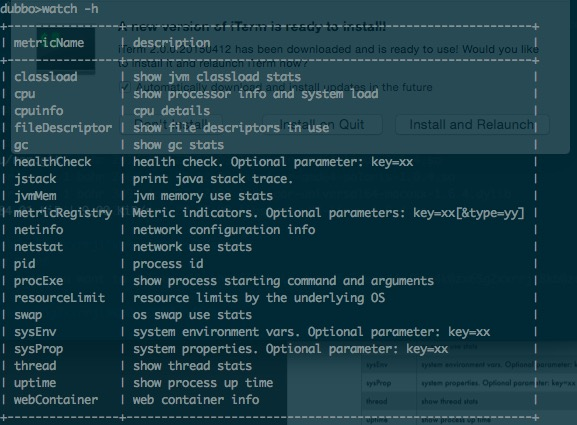

## watcher
**watcher**(守望者)提供监控系统/jvm的能力。应用使用它，可以把相关的指标暴露出来，目前支持`http`和`dubbo`两种方式暴露监控指标。

## 1. showcase

### 1.1 http
首页:

例如查看thread，访问`http://127.0.0.1:11111/watcher/q.do?action=thread`返回:

	{
		"deadlockedThreadsCount":0,
		"deadlockedThreads":[],
		"threadCount":19,
		"totalStartedThreadCount":145,
		"daemonThreadCount":18,
		"peakThreadCount":19
	}
### 1.2 dubbo

连接dubbo端口并且执行监控命令:

	telnet 127.0.0.1 20880
	watch -h

查看thread,输入:

	watch thread

返回：

	{"deadlockedThreadsCount":0,"deadlockedThreads":[],"threadCount":26,"totalStartedThreadCount":173,"daemonThreadCount":25,"peakThreadCount":26}

## 2. 如何使用
	
### 2.1 依赖：
	
	<dependency>
 		<groupId>com.yiji.framework</groupId>
    	<artifactId>yiji-watcher</artifactId>
    	<version>1.0</version>
	</dependency>
	
### 2.2 web应用配置：

#### 2.2.1 配置web.xml
	 
	<servlet>
        <servlet-name>WatcherServlet</servlet-name>
        <servlet-class>com.yiji.framework.watcher.adaptor.web.WatcherServlet</servlet-class>
    </servlet>
    <servlet-mapping>
        <servlet-name>WatcherServlet</servlet-name>
        <url-pattern>/watcher/*</url-pattern>
    </servlet-mapping>

#### 2.2.2 servlet 3.0 java编程式配置

	WatcherServlet watcherServlet = new WatcherServlet("test");
	ServletRegistration.Dynamic servletRegistration = servletContext.addServlet("watcherServlet", watcherServlet);
			servletRegistration.addMapping("/watcher/*");
    
### 2.3 dubbo应用配置：
 
 	<dubbo:provider timeout="60000" cluster="failfast" telnet="watch"/>
	
在`dubbo:provider`上的`telnet`加`watch`

## 3. 快速体验

下载源代码后导入IDE，执行`com.yiji.framework.watcher.WatherTomcatBootStrap`类，控制台会输出如下的提示，`http`端口11111，dubbo服务端口`20880`

	应用启动成功,耗时:5235ms
	web: http://127.0.0.1:11111/watcher/
	dubbo: telnet 127.0.0.1 20880
	您可以直接在console里输入回车重启应用

## 4. 提供的监控能力

	+----------------+----------------------------------------------------------	+
	| metricName     | description                                              	|
	+----------------+----------------------------------------------------------	+
	| classload      | show jvm classload stats                                 	|
	| cpu            | show processor info and system load                      	|
	| cpuinfo        | cpu details                                              	|
	| fileDescriptor | show file descriptors in use                             	|
	| gc             | show gc stats                                            	|
	| healthCheck    | health check. Optional parameter: key=xx                 	|
	| jstack         | print java stack trace.                                  	|
	| jvmMem         | jvm memory use stats                                     	|
	| metricRegistry | Metric indicators. Optional parameters: key=xx[&type=yy] 	|
	| netinfo        | network configuration info                               	|
	| netstat        | network use stats                                        	|
	| pid            | process id                                               	|
	| procExe        | show process starting command and arguments              	|
	| resourceLimit  | resource limits by the underlying OS                     	|
	| swap           | os swap use stats                                        	|
	| sysEnv         | system environment vars. Optional parameter: key=xx      	|
	| sysProp        | system properties. Optional parameter: key=xx            	|
	| thread         | show thread stats                                        	|
	| uptime         | show process up time                                     	|
	| webContainer   | web container info                                       	|
	+----------------+----------------------------------------------------------+
	
操作系统相关的信息，通过[sigar](https://github.com/hyperic/sigar)获取,sigar不支持window,window下某些监控数据获取不到。

## 5. 如何添加指标

`watcher`提供了通过`metrics`来添加监控指标。当然也可以通过`watcher`的方式来添加监控指标。

### 5.1 `metircs style`
watcher内部集成了[metrics](https://github.com/dropwizard/metrics),需要添加自己的指标也可以通过metircs的方式来。这里需要使用`com.yiji.framework.watcher.MetricsHolder`来获取`MetricRegistry`或者`HealthCheckRegistry`.

当然，您的核心公共库(方便其他组件添加指标)不想依赖`watcher`，也没有关系(其实我们也有这样的问题)，`MetricsHolder`内部使用的`SharedMetricRegistries`,您只需要在您的核心公共库中保证名字相同就ok。

访问时，通过`metricName=metricRegistry`来访问`MetricRegistry，通过`metricName=healthCheck`来访问监控检查。

### 5.2 `watcher style`

继承`com.yiji.framework.watcher.metrics.AbstractMonitorMetrics`类，然后通过`DefaultMonitorService#addMonitorMetrics`注册。

`DefaultMonitorService`默认会扫描`com.yiji.framework.watcher.metrics`下的所有`MonitorMetrics`.

## 6.其他

### 6.1 访问控制

`watcher`提供了简单的访问控制filter `com.yiji.framework.watcher.adaptor.web.WatcherFilter`,仅内网可以访问。